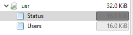
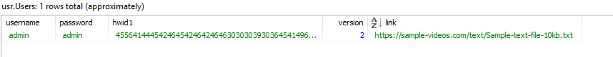
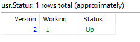
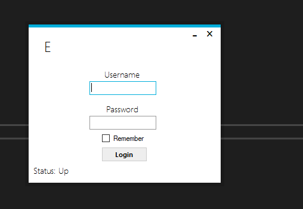

# C#-E-launcher
a c# launcher for anything that can be downloaded - this project was made to learn C# language and MySQL common queries - project date 2017

----
The launcher starting view is a login form.  
The user needs to enter his username and password to access the main form.  
After the user enters his username and password the launcher makes a query to the MySQL server and checks if there is a user with that username and password in Users MySQL table. The next verification step is based on user HWID (the HWID is a hex string that is made from the users pc specs(processor/ram/video card/etc).  
If this three steps are passed successfully the user is redirected to the main form.  

On the main form, there are two buttons.  
The update button access the link column from the SQL table and downloads that on the pc.  
The start button launches the file that was downloaded by pressing the update button.  

## Make this application working:  
First of all for compiling you need to have mysql connector for .NET.  
[mysql .NET connector](https://dev.mysql.com/downloads/connector/net/8.0.html)  

After that you need a MySQL server with this exact setup:  
- a 'usr' database  
- two tables : 'Status' / 'Users'  
- for columns see the screenshots:  

Database:  

,
    
Users Table:                                  
  
Status Table:  
  

---
 Design:
 

  
  
  
    
